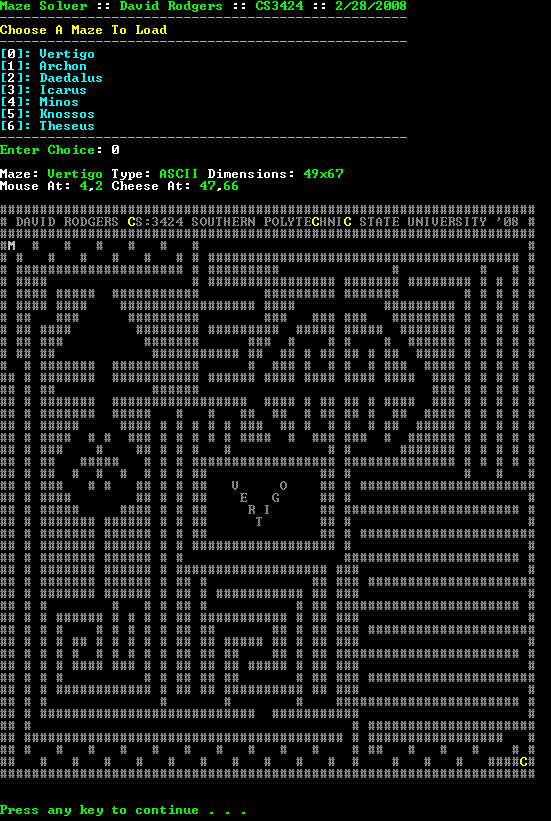
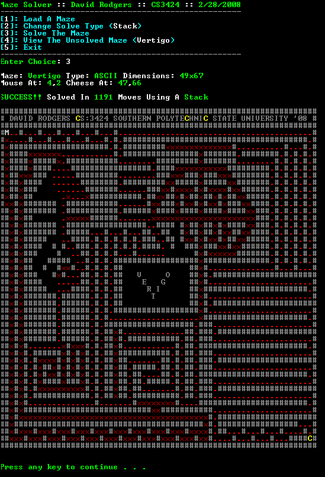
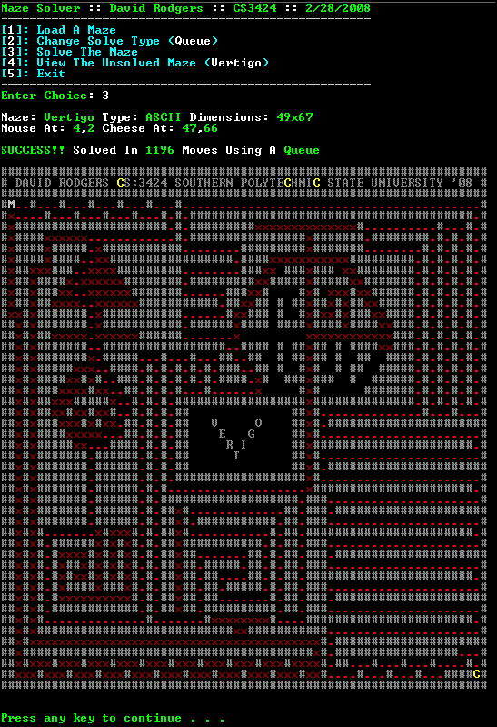
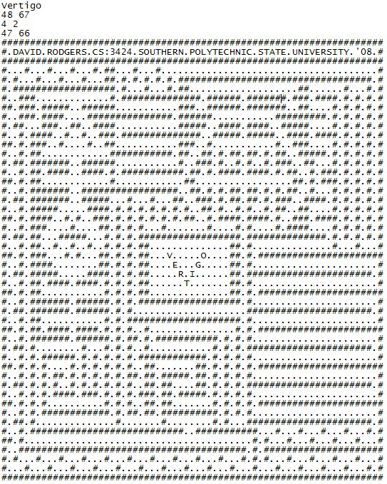
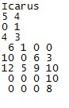

# Maze Solver

  

# Description
This was a project I wrote for CS3423: Data Structures in C++. The objective of this [Assignment](assignment/CS3424_s08a2.pdf) is to demonstrate the ability to write a program that utilizes the stack and queue data structures and to understand the differences between the two in terms of construction and performance. I decided to take the assignment a step further by implementing the ability to visualize the algorithm’s results and allowing complex mazes to be created visually using ASCII characters.

The [original project specification](assignment/CS3424_s08a2.pdf) required that I read in a text file full of values and print out the sequence of directions (N,S,E,W) required to solve the maze. That seemed a little boring, so I implemented the ability to see what path the mouse had taken through the maze by showing indicators for valid traversal, backtracking, and any errors encountered during its hunt for the cheese.

To make this more interesting, the design I came up with allowed for two different maze formats to be processed. The first stuck to the specification and read in the maze as a series of bits, while the other read in mazes designed with ASCII. This allowed me to visually design elaborate mazes of any size. I created a series of mazes and named some of them after famous maze oriented deities ([Daedalus, Icarus, Knossos, Minos, Theseus](https://www.google.com/search?q=Daedalus%2C+Icarus%2C+Knossos%2C+Minos%2C+Theseus)). 

I had started writing code that allowed you to watch the mouse move through the maze in real-time, but I never got around to finishing it. I was in the middle of debugging the screen refresh that occured after each move when the semester ended.

# Screenshots

## Load Maze: ASCII

  

## Maze Solve: Stack

  

## Maze Solve: Queue

  

## Maze Format: ASCII

  

## Maze Format: Bit

  

# Copyright

This project is distributed under the **MIT License**. Please see the included **COPYRIGHT** and **LICENSE** for more information.